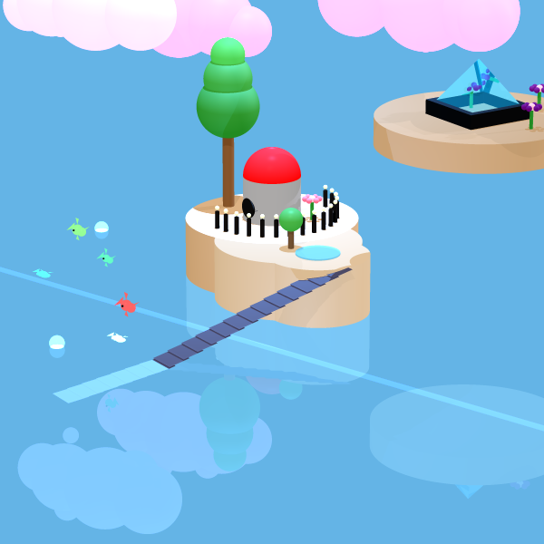

# Magical Underwater Scene – Ray Tracing Project

## Overview
This project implements a 3D ray tracing engine in Java, used to render a detailed and visually rich underwater scene titled "Magical Underwater Scene".

The project combines geometric modeling, lighting, material simulation, and advanced rendering techniques, alongside performance optimizations to achieve high-quality output within efficient runtime.

---

## Scene Description
The scene simulates a stylized underwater environment composed of multiple elements:

- Transparent water surface with reflection and refraction effects  
- Floating islands constructed from geometric primitives  
- Central structure composed of cylinders and spheres  
- Vegetation including trees and flowers  
- Decorative elements such as fences, lights, and pathways  
- Fish and bubbles simulating underwater motion  
- Glass pyramid structure with a solid base  
- Submerged glowing tube representing internal light flow  
- Layered cloud-like background elements  

The scene integrates various materials, transparency levels, and lighting interactions to create depth and realism.

---

## Rendering Techniques

### Anti-Aliasing
Implemented supersampling by casting multiple rays per pixel (up to 81 rays) and averaging results to reduce aliasing artifacts and improve edge smoothness.

### Adaptive Super Sampling
Optimized sampling by dynamically subdividing pixels only in regions with high color variance, reducing unnecessary computations while preserving image quality.

### Jittering
Introduced controlled randomness in ray generation to simulate natural visual effects such as soft shadows, water distortion, and smoother transitions.

### Refraction
Implemented light refraction through transparent materials such as water and glass, based on physical laws and refractive indices.

---

## Performance Optimization

### Multithreading
Parallelized the rendering process by distributing pixel computations across multiple threads using ExecutorService.

### Performance Results
The combination of Adaptive Sampling and Multithreading reduced runtime by up to ~97% compared to the baseline rendering approach.

---

## Technologies

- Programming Language: Java  
- Development Environment: IntelliJ IDEA  
- Concurrency: Java ExecutorService  
- Rendering: Custom Ray Tracing Engine  

---

## Key Learnings

- Implementation of a full ray tracing pipeline  
- Trade-offs between rendering quality and performance  
- Efficient use of multithreading for compute-heavy tasks  
- Application of physical light behavior (reflection, refraction)  
- Design of scalable rendering algorithms  

---

## How to Run

1. Clone the repository  
2. Open the project in IntelliJ IDEA  
3. Run the main rendering class  
4. The rendered image will be generated as output  
